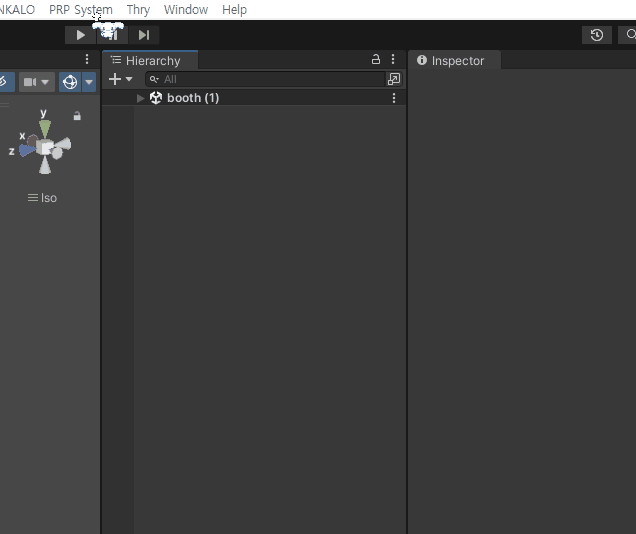
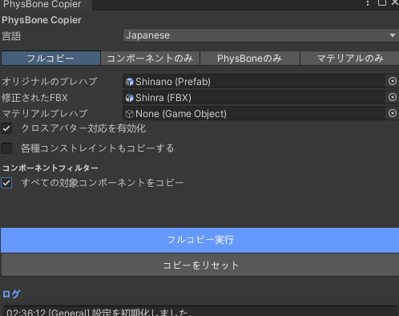

※ 本説明は、  
Phys Bone Full Copier（ver.1.1.5）がすでに Unity にインポートされている状態を前提としています。

---

### 1) ツールを起動する

Unity 上部メニューから、  
PRP System → Phys Bone Full Copier → Avatar Phys Bone Copier
の順に選択し、ツールを開いてください。

---

### 2) コピー元・コピー先を設定する

- オリジナル Prefab

  コピー元となる、すでに設定済みの Prefab を指定します。

- 修正済み FBX

  設定を移行したい、修正後の FBX を指定します。

⭐ 本ツールは、**同一のボーン構造（同一衣装）間でのみ**コピーが可能です。

本マニュアルでは、説明用の例として  
オリジナル Prefab に Shinano 用衣装（すでに設定済みの Prefab）、  
修正済み FBX に Shinra 用衣装を使用します。

---

### 3) ポップアップについて

ボーン構造に差分がある場合、  
構造差分を確認するためのポップアップが表示されることがあります。

これはエラーではなく、  
構造差分を検知した際に表示される通常の確認画面です。

内容を確認したうえで、  
「Yes」 を選択してください。

---

### 4) コンポーネントフィルターについて

コピー対象となるコンポーネントは、  
チェックボックス（フィルター）で選択できます。

初期設定では、  
メッシュベースの Modular Avatar コンポーネントは  
無効（チェック OFF）になっています。

各項目にマウスカーソルを合わせると、  
対象コンポーネントの詳細説明が表示されます。

必要な Modular Avatar コンポーネントがある場合のみ、  
該当項目を有効にしてください。

---

### 5) Constraint コピーについて

Constraint も同様にコピー可能です。

ただし、
Breast を含む Constraint は、
ボーン構造や姿勢差の影響を特に受けやすい箇所です。

そのため、
該当するチェックボックスを無効のままコピーを行うと、
Breast 周辺のボーンが安全でない形で自動対応されてしまい、
回転ずれや位置の破綻が発生するリスクが高くなります。

その結果、
衣装の胸部メッシュやアクセサリーが
ねじれたり、不自然な挙動になる可能性があります。

Breast を含む Constraint が存在する場合は、
こうしたトラブルを回避するために、

## 該当するチェックボックスを有効にした上でコピーを行ってください。

※ コピー後は必ず挙動を確認し、
必要に応じて手動で微調整することを推奨します。

---

### 6) コピーを実行する

設定が完了したら、  
全体コピー実行ボタンを押してください。

コピー処理が完了すると、  
何のセッティングもなかったFBXにも、適用されます。

---

### 7) マテリアルのみをコピーしたい場合

すでに物理設定のコピーが完了しており、  
マテリアルのみをコピーしたい場合は、  
「全体コピー」ではなく、Material Only タブを使用してください。

Material Only タブで、  
マテリアル Prefab に  
既存のカラー設定済み Prefab を指定することで、  
マテリアルのみを個別にコピーできます。

※ なお、こちらについても  
メッシュ名が一致していることが前提条件となります。

